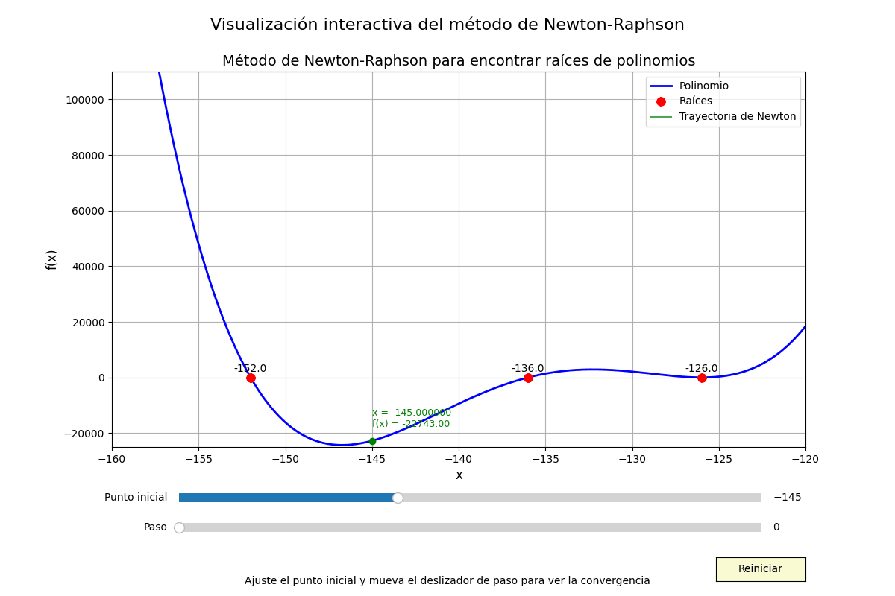
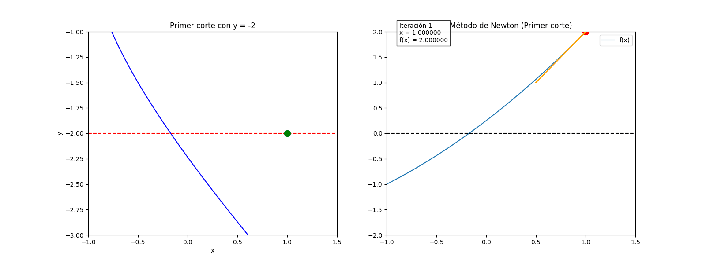
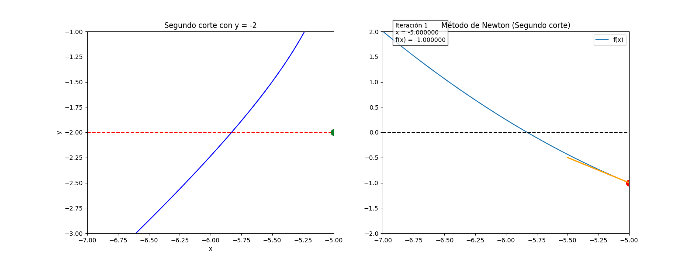
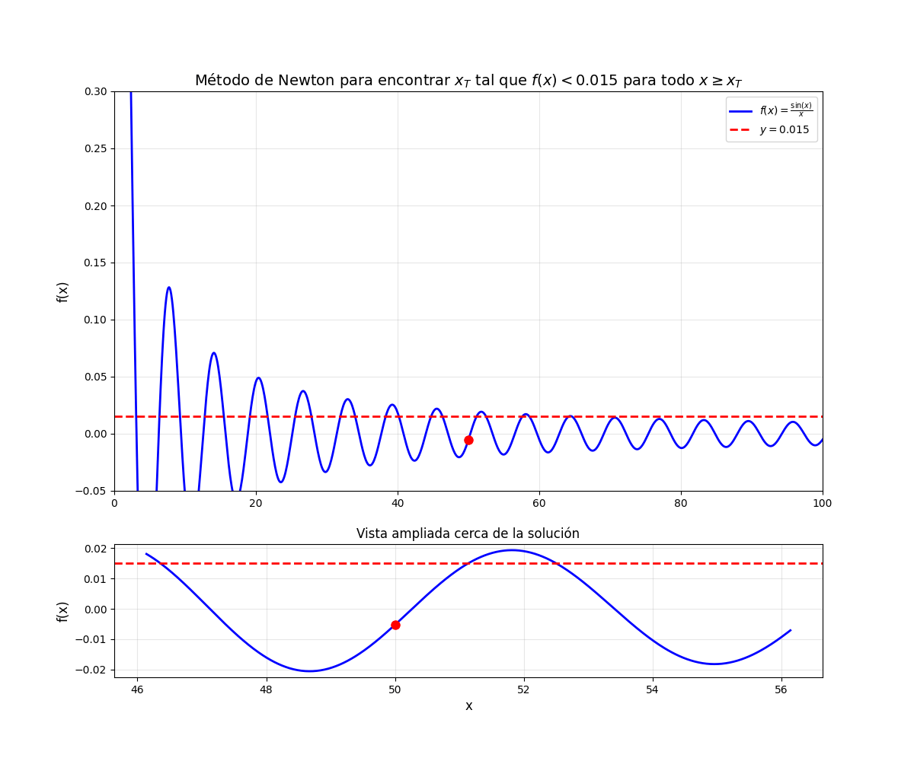

# Taller 02: Cálculo de Raices

### Integrantes
- Jairo Angulo
- Richard Tipantiza

## Ejercicio 01
- Encuentre todas las raíces del polinomio $x^4 + 540x^3 + 109124x^2 + 9781632x + 328188672 = 0$.

## Ejercicio 02

- Encuentre todos los puntos en los que la curva  
$(\frac{y}{2})^2 = (\frac{x + 3}{2})^2 - 1$ interseca el eje $y = -2$.

#### Primer corte

#### Segundo corte

## Ejercicio 03

- Dada la función  
$f(x) = \frac{\sin(x)}{x}$ 
¿A partir de qué valor $x_T$ se cumple que $f(x) < 0.015,\ \forall x \geq x_T$?

